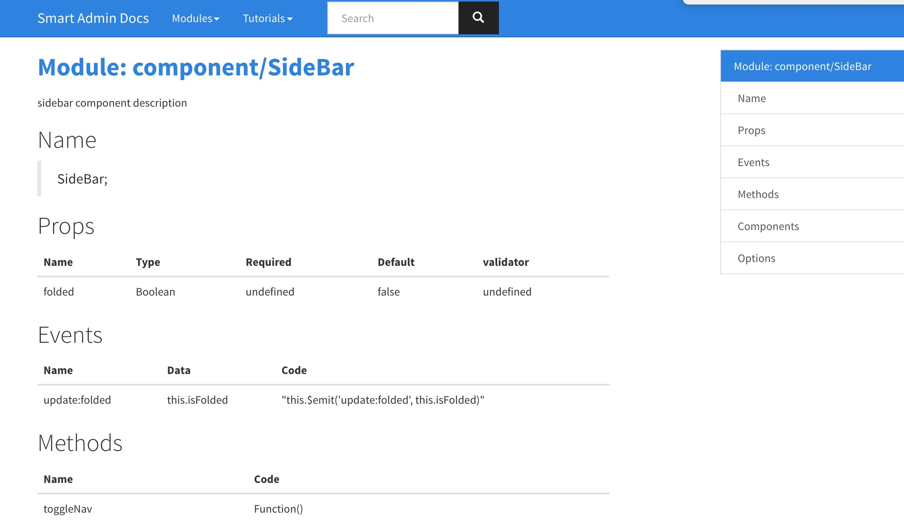

# jsdoc-vuedoc

> A jsdoc plugin use [@vuedoc/md](https://github.com/vuedoc/md).

## Dependencies

> This plugin dependence on [@vuedoc/md](https://github.com/vuedoc/md), if has troubles that can not fixed immediately, you can use [jsdoc-vue-component](https://github.com/ccqgithub/jsdoc-vue-component) as a fallback.

- node@8.x: That support `async/await` features.
- [@vuedoc/md](https://github.com/vuedoc/md).

## Installation

```sh
npm i jsdoc-vuedoc -D
```

## options

> add `jsdoc-vuedoc` node to `jsdoc.json`.

- `tag`: default `@vuedoc`.
- `log`: default `true`.
- the other [vuedco/md options](https://github.com/vuedoc/parser#options).

## Use:

> This plugin just extract the component's info into `markdown` format, and instert it into the `@vuedoc`'s position.

> Not affect other jsdoc features of the code.

1. add `@vuedoc` tag to comment.
2. add `@exports componentName` tag to comment.

just add `@vuedoc` tag, `@exports` tag, to the to document in you vue SFC.

```js
/**
 * sidebar component description
 * @vuedoc
 * @exports component/SideBar
 */
export default {}
```

## 如何使用jsdoc？

- 安装jsdoc: `npm i jsdoc -D`
- 安装模板：`npm i sherry-docstrap -D`, 原来的[docstrap](https://github.com/docstrap/docstrap)有点小bug还未修复，所以自己暂时发布一个。
- 在项目目录下建了配置文件：下面有示例，适当修改。
- 在pacakge.json 里添加一个script: `"jsdoc": "rm -rf public/jsdoc && node_modules/.bin/jsdoc -c jsdoc.json"`, `public/jsdoc`为发布位置，适当修改
- 生成文档: `npm run jsdoc`


## jsdoc.json

```json
{
  "plugins": [
    "node_modules/jsdoc-vuedoc",
    "plugins/markdown",
    "plugins/summarize"
  ],
  "jsdoc-vuedoc": {
    "tag": "vuedoc"
  },
  "markdown": {
    "tags": ["author", "classdesc", "description", "param", "property", "returns", "see", "throws"]
  },
  "recurseDepth": 10,
  "source": {
    "include": ["fe/src"],
    "includePattern": ".+\\.(js|vue)$",
    "excludePattern": "(^|\\/|\\\\)_"
  },
  "sourceType": "module",
  "tags": {
    "allowUnknownTags": true,
    "dictionaries": ["jsdoc", "closure"]
  },
  "templates": {
    "logoFile": "",
    "cleverLinks": false,
    "monospaceLinks": false,
    "dateFormat": "ddd MMM Do YYYY",
    "outputSourceFiles": true,
    "outputSourcePath": true,
    "systemName": "DocStrap",
    "footer": "",
    "copyright": "DocStrap Copyright © 2012-2015 The contributors to the JSDoc3 and DocStrap projects.",
    "navType": "vertical",
    "theme": "cosmo",
    "linenums": true,
    "collapseSymbols": false,
    "inverseNav": true,
    "protocol": "html://",
    "methodHeadingReturns": false
  },
  "markdown": {
    "parser": "gfm",
    "hardwrap": true
  },
  "opts": {
    "template": "node_modules/sherry-docstrap/template",
    "encoding": "utf8",
    "destination": "./public/jsdoc/",
    "recurse": true,
    "readme": "README.md",
    "tutorials": "./docs/"
  }
}
```

## 效果

.
